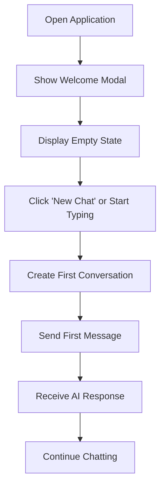
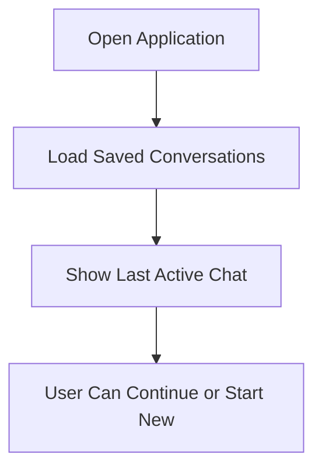
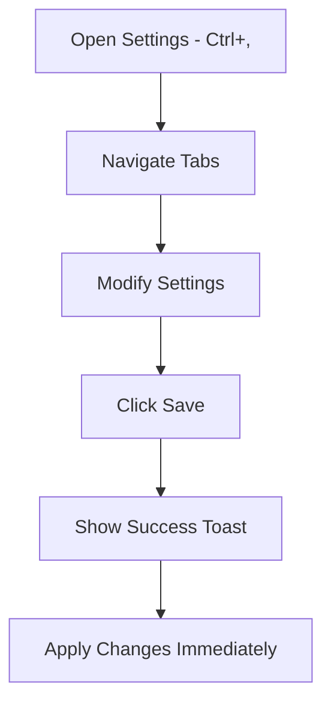

# Genesis AI - Example Project Specification

> **A showcase web application demonstrating the DOSage component library**

---

## 📋 Overview

**Genesis AI** is a retro-styled AI chatbot interface that serves as the flagship example project for the DOSage component library. The application demonstrates how to build a complete, functional web interface using only DOSage components while maintaining the authentic DOS aesthetic.

### Project Goals

1. **Showcase Component Breadth** — Demonstrate as many DOSage components as possible in a cohesive, meaningful way
2. **Prove Real-World Viability** — Show that DOSage can power a complete, functional application
3. **Serve as Learning Resource** — Provide developers with patterns and examples they can adapt
4. **Maintain DOS Authenticity** — Every visual element should feel like it belongs in a DOS application

### Design Philosophy

> *"If it looks like it could run on a 386, we're doing it right."*

- No custom CSS styling — rely entirely on DOSage theming
- No external UI frameworks — every element is a DOSage component
- No rounded corners, gradients, or modern flourishes
- Box-drawing characters and ASCII art define the visual language

---

## 🏗️ Architecture

### Project Structure

```
examples/
└── genesis-ai/
    ├── index.html              # Entry point
    ├── package.json            # Dependencies
    ├── tsconfig.json           # TypeScript config
    ├── vite.config.ts          # Vite bundler config
    └── src/
        ├── main.ts             # Application bootstrap
        ├── styles.css          # Minimal CSS resets only
        ├── app.ts              # Main application orchestrator
        ├── types.ts            # TypeScript interfaces
        ├── config.ts           # Configuration constants
        ├── components/
        │   ├── layout/
        │   │   ├── AppShell.ts        # Main layout container
        │   │   ├── Header.ts          # Top menu bar
        │   │   └── StatusBar.ts       # Bottom status bar
        │   ├── chat/
        │   │   ├── ChatWindow.ts      # Main chat interface
        │   │   ├── MessageList.ts     # Message display area
        │   │   ├── MessageBubble.ts   # Individual message
        │   │   ├── ChatInput.ts       # User input area
        │   │   └── TypingIndicator.ts # AI typing animation
        │   ├── sidebar/
        │   │   ├── ConversationList.ts    # Chat history sidebar
        │   │   ├── ConversationItem.ts    # Single conversation
        │   │   └── QuickActions.ts        # Quick action buttons
        │   ├── modals/
        │   │   ├── SettingsModal.ts   # Settings dialog
        │   │   ├── AboutModal.ts      # About/credits dialog
        │   │   ├── HelpModal.ts       # Help documentation
        │   │   └── ExportModal.ts     # Export conversation
        │   └── shared/
        │       ├── Logo.ts            # ASCII art logo
        │       └── ThemeSwitcher.ts   # Theme toggle
        ├── services/
        │   ├── ChatService.ts     # Chat logic (mock AI)
        │   ├── StorageService.ts  # LocalStorage persistence
        │   └── CommandService.ts  # Command palette actions
        └── utils/
            ├── formatters.ts      # Date/text formatting
            └── sounds.ts          # Retro beep sounds (optional)
```

---

## 🎨 Component Inventory

### Components Used (50+ components)

The following table maps DOSage components to their usage in Genesis AI:

| Category | Component | Usage Location | Purpose |
|----------|-----------|----------------|---------|
| **Layout** | `SplitPane` | AppShell | Sidebar + chat area split |
| | `Panel` | Multiple | Content containers |
| | `Container` | AppShell | Page wrapper |
| | `Box` | Various | Spacing/grouping |
| | `Divider` | Sidebar | Section separation |
| | `ScrollArea` | MessageList | Scrollable messages |
| **Navigation** | `MenuBar` | Header | File, Edit, View, Help menus |
| | `Sidebar` | ConversationList | Chat history navigation |
| | `Tabs` | SettingsModal | Settings categories |
| | `Breadcrumbs` | HelpModal | Help navigation |
| **Typography** | `Heading` | Various | Section titles |
| | `Text` | Various | Body content |
| | `Code` | MessageBubble | Inline code |
| | `CodeBlock` | MessageBubble | Code snippets |
| | `ASCIIArt` | Logo, AboutModal | Decorative ASCII |
| | `Label` | Forms | Input labels |
| **Buttons & Actions** | `Button` | Various | Primary actions |
| | `ButtonGroup` | ChatInput | Send/Clear actions |
| | `IconButton` | Various | Icon-only actions |
| | `Link` | Various | Navigation links |
| **Forms** | `Textarea` | ChatInput | Message input |
| | `TextInput` | SettingsModal | API key, name |
| | `Select` | SettingsModal | Model selection |
| | `Toggle` | SettingsModal | Feature toggles |
| | `Checkbox` | SettingsModal | Options |
| | `RadioButton` | SettingsModal | Theme selection |
| | `Slider` | SettingsModal | Temperature setting |
| **Feedback** | `Toast` | Various | Notifications |
| | `Alert` | Various | Important messages |
| | `Modal` | Modals | Dialog windows |
| | `ProgressBar` | Various | Loading states |
| | `LoadingSpinner` | TypingIndicator | AI thinking |
| | `Tooltip` | IconButtons | Button hints |
| **Data Display** | `ListBox` | ConversationList | Selectable list |
| | `Card` | MessageBubble | Message container |
| | `Badge` | Various | Status indicators |
| | `Avatar` | MessageBubble | User/AI avatars |
| | `Timeline` | AboutModal | Version history |
| | `Accordion` | HelpModal | FAQ sections |
| | `EmptyState` | MessageList | No messages state |
| **Advanced** | `CommandPalette` | Global | Quick commands |
| | `ContextMenu` | MessageBubble | Right-click menu |
| | `Window` | Optional | Floating windows |
| | `Popover` | Various | Dropdown content |
| | `DropdownMenu` | MenuBar | Menu dropdowns |
| **Utilities** | `Portal` | Modals, Toasts | Overlay mounting |
| | `FocusTrap` | Modals | Accessibility |
| | `KeyboardShortcutHandler` | Global | Keyboard shortcuts |
| | `VisuallyHidden` | Various | Screen reader text |

---

## 🖥️ UI Layout Specification

### Main Application Shell

```
┌─────────────────────────────────────────────────────────────────────────┐
│ File   Edit   View   Help                                    [GENESIS AI]│
├────────────────────┬────────────────────────────────────────────────────┤
│ ┌────────────────┐ │ ╔══════════════════════════════════════════════════╗│
│ │  CONVERSATIONS │ │ ║                                                  ║│
│ │────────────────│ │ ║   ┌─────────────────────────────────────────┐   ║│
│ │ ► Today        │ │ ║   │ [AI] Hello! How can I assist you today?│   ║│
│ │   ├ Chat 1     │ │ ║   └─────────────────────────────────────────┘   ║│
│ │   └ Chat 2     │ │ ║                                                  ║│
│ │ ► Yesterday    │ │ ║   ┌─────────────────────────────────────────┐   ║│
│ │   └ Chat 3     │ │ ║   │ [You] Can you explain recursion?       │   ║│
│ │                │ │ ║   └─────────────────────────────────────────┘   ║│
│ │                │ │ ║                                                  ║│
│ │                │ │ ║   ┌─────────────────────────────────────────┐   ║│
│ │                │ │ ║   │ [AI] Certainly! Recursion is when a    │   ║│
│ │                │ │ ║   │ function calls itself...               │   ║│
│ │                │ │ ║   └─────────────────────────────────────────┘   ║│
│ │                │ │ ║                                                  ║│
│ ├────────────────┤ │ ║               ▄▀ AI is typing...                ║│
│ │ [+ New Chat]   │ │ ╠══════════════════════════════════════════════════╣│
│ │ [⚙ Settings]   │ │ ║ ┌──────────────────────────────────────────────┐║│
│ │ [? Help]       │ │ ║ │ Type your message...                        │║│
│ │                │ │ ║ │                                              │║│
│ └────────────────┘ │ ║ └──────────────────────────────────────────────┘║│
│                    │ ║           [Clear]  [Send ►]                     ║│
│                    │ ╚══════════════════════════════════════════════════╝│
├────────────────────┴────────────────────────────────────────────────────┤
│ Ready │ Tokens: 1,234 │ Model: GPT-4 │ ████████░░ 80% │ Press Ctrl+K    │
└─────────────────────────────────────────────────────────────────────────┘
```

### Component Mapping to Layout

| Layout Region | Primary Component | Supporting Components |
|---------------|-------------------|----------------------|
| Top Menu | `MenuBar` | `DropdownMenu`, `KeyboardShortcutHandler` |
| Left Sidebar | `Sidebar` + `SplitPane` | `ListBox`, `Button`, `Divider`, `Badge` |
| Chat Header | `Panel` | `Heading`, `Badge`, `IconButton` |
| Message Area | `ScrollArea` | `Card`, `Avatar`, `Text`, `Code`, `CodeBlock` |
| Typing Indicator | `Box` | `LoadingSpinner`, `Text` |
| Input Area | `Panel` | `Textarea`, `ButtonGroup`, `Button` |
| Status Bar | `Box` | `Text`, `ProgressBar`, `Badge`, `Tooltip` |

---

## 📱 Feature Specifications

### 1. Chat Interface

#### Message Display (`MessageList.ts`, `MessageBubble.ts`)

**Components Used:** `ScrollArea`, `Card`, `Avatar`, `Text`, `Code`, `CodeBlock`, `Badge`, `Tooltip`, `ContextMenu`

**Behavior:**
- Messages displayed in scrollable area with auto-scroll on new messages
- User messages aligned right, AI messages aligned left
- Avatars show initials: `[AI]` for assistant, `[U]` for user
- Timestamps shown on hover via `Tooltip`
- Right-click context menu with Copy, Delete, Regenerate options
- Code blocks with syntax indication and copy button
- Markdown-like formatting support (bold, code, lists)

**Message Bubble Structure:**
```
┌─────────────────────────────────────────┐
│ [AI]  Genesis AI              12:34 PM  │
├─────────────────────────────────────────┤
│ Here's an example:                      │
│                                         │
│ ┌─────────────────────────────────────┐ │
│ │ function hello() {                  │ │
│ │   console.log("Hello, world!");     │ │
│ │ }                                   │ │
│ └─────────────────────────────────────┘ │
│                                         │
│ [Copy]  [Regenerate]                    │
└─────────────────────────────────────────┘
```

#### Chat Input (`ChatInput.ts`)

**Components Used:** `Textarea`, `ButtonGroup`, `Button`, `Badge`, `Tooltip`

**Behavior:**
- Multi-line textarea with auto-resize (max 6 rows)
- Character counter badge showing limit
- `Ctrl+Enter` sends message
- `Shift+Enter` for new line
- Send button disabled when empty
- Clear button resets input

#### Typing Indicator (`TypingIndicator.ts`)

**Components Used:** `Box`, `LoadingSpinner`, `Text`

**Behavior:**
- Animated ASCII spinner: `|`, `/`, `-`, `\`
- Text: "Genesis AI is thinking..."
- Appears when AI response is pending
- Fades in/out smoothly

### 2. Conversation Sidebar

#### Conversation List (`ConversationList.ts`)

**Components Used:** `Sidebar`, `ListBox`, `Badge`, `Button`, `Divider`, `EmptyState`

**Behavior:**
- Grouped by date: Today, Yesterday, Last 7 Days, Older
- Shows conversation title (first message truncated)
- Badge shows message count
- Click to switch conversations
- Active conversation highlighted
- Empty state when no conversations

**Sidebar Structure:**
```
┌────────────────────┐
│   CONVERSATIONS    │
├────────────────────┤
│ ▼ Today            │
│   ├─● Recursion... │ ← Active (● indicator)
│   └─○ API Help     │
│ ► Yesterday        │ ← Collapsed
│ ► Last 7 Days      │
├────────────────────┤
│ [+ New Chat]       │
│ [⚙ Settings]       │
│ [? Help]           │
└────────────────────┘
```

#### Quick Actions (`QuickActions.ts`)

**Components Used:** `ButtonGroup`, `Button`, `IconButton`, `Tooltip`

**Actions:**
- New Chat: Creates new conversation
- Settings: Opens settings modal
- Help: Opens help modal

### 3. Menu Bar

#### Header Menu (`Header.ts`)

**Components Used:** `MenuBar`, `DropdownMenu`, `KeyboardShortcutHandler`

**Menu Structure:**
```
┌───────┬───────┬───────┬───────┐
│ File  │ Edit  │ View  │ Help  │
└───────┴───────┴───────┴───────┘

File                    Edit                   View                   Help
├─ New Chat    Ctrl+N   ├─ Copy        Ctrl+C  ├─ Toggle Sidebar F9   ├─ Quick Commands Ctrl+K
├─ Open...     Ctrl+O   ├─ Paste       Ctrl+V  ├─ Zoom In      Ctrl+= ├─ Documentation
├─ Export...   Ctrl+E   ├─ Select All  Ctrl+A  ├─ Zoom Out     Ctrl+- ├─ Keyboard Shortcuts
├───────────────────    ├─ Clear Chat          ├─ Reset Zoom   Ctrl+0 ├───────────────────────
├─ Settings    Ctrl+,   └─ Find        Ctrl+F  ├───────────────────── ├─ Report Issue
└─ Exit        Alt+F4                          ├─ Theme ►             └─ About Genesis AI
                                               │  ├─ DOS Blue
                                               │  ├─ Amber
                                               │  ├─ Green Phosphor
                                               │  └─ CGA
                                               └─ Fullscreen    F11
```

### 4. Command Palette

#### Global Commands (`CommandService.ts`)

**Component Used:** `CommandPalette`

**Trigger:** `Ctrl+K` or `Ctrl+P`

**Available Commands:**
```
C:\> _
├─ ► New Chat                    Ctrl+N
├─ ► Open Settings               Ctrl+,
├─ ► Toggle Sidebar              F9
├─ ► Switch Theme: DOS Blue
├─ ► Switch Theme: Amber
├─ ► Switch Theme: Green Phosphor
├─ ► Switch Theme: CGA
├─ ► Export Conversation         Ctrl+E
├─ ► Clear Current Chat
├─ ► Show Help                   F1
├─ ► About Genesis AI
└─ ► Toggle Fullscreen           F11
```

### 5. Modals

#### Settings Modal (`SettingsModal.ts`)

**Components Used:** `Modal`, `Tabs`, `Panel`, `TextInput`, `Select`, `Toggle`, `Checkbox`, `RadioButton`, `Slider`, `Button`, `ButtonGroup`

**Structure:**
```
╔═══════════════════════════════════════════════════════════════╗
║  ╔═══════════════════════════════════════════════════════╗   ║
║  ║                      SETTINGS                          ║   ║
║  ╠═══════════════════════════════════════════════════════╣   ║
║  ║ [General] [Appearance] [Chat] [Advanced]              ║   ║
║  ╠═══════════════════════════════════════════════════════╣   ║
║  ║                                                        ║   ║
║  ║  Display Name: [John Doe________________]              ║   ║
║  ║                                                        ║   ║
║  ║  Theme:        (●) DOS Blue                            ║   ║
║  ║                ( ) Amber                               ║   ║
║  ║                ( ) Green Phosphor                      ║   ║
║  ║                ( ) CGA                                 ║   ║
║  ║                                                        ║   ║
║  ║  Sound Effects: [ON ][OFF]                             ║   ║
║  ║  Timestamps:    [ON ][OFF]                             ║   ║
║  ║                                                        ║   ║
║  ╠═══════════════════════════════════════════════════════╣   ║
║  ║                          [Cancel]  [Save Settings]     ║   ║
║  ╚═══════════════════════════════════════════════════════╝   ║
╚═══════════════════════════════════════════════════════════════╝
```

**Settings Tabs:**

| Tab | Settings | Components |
|-----|----------|------------|
| General | Display name, Default model | `TextInput`, `Select` |
| Appearance | Theme, Font size, Animations | `RadioButton`, `Slider`, `Toggle` |
| Chat | Auto-scroll, Timestamps, Sound | `Toggle`, `Checkbox` |
| Advanced | API Key, Temperature, Max tokens | `PasswordInput`, `Slider`, `TextInput` |

#### About Modal (`AboutModal.ts`)

**Components Used:** `Modal`, `ASCIIArt`, `Text`, `Timeline`, `Link`, `Badge`

**Content:**
- ASCII art logo
- Version information with badge
- Brief description
- Version history timeline
- Links to documentation and repository

```
╔═══════════════════════════════════════════════════════════════╗
║                     ABOUT GENESIS AI                          ║
╠═══════════════════════════════════════════════════════════════╣
║                                                               ║
║     ██████╗ ███████╗███╗   ██╗███████╗███████╗██╗███████╗    ║
║    ██╔════╝ ██╔════╝████╗  ██║██╔════╝██╔════╝██║██╔════╝    ║
║    ██║  ███╗█████╗  ██╔██╗ ██║█████╗  ███████╗██║███████╗    ║
║    ██║   ██║██╔══╝  ██║╚██╗██║██╔══╝  ╚════██║██║╚════██║    ║
║    ╚██████╔╝███████╗██║ ╚████║███████╗███████║██║███████║    ║
║     ╚═════╝ ╚══════╝╚═╝  ╚═══╝╚══════╝╚══════╝╚═╝╚══════╝    ║
║                         AI                                    ║
║                                                               ║
║    Version: [1.0.0]  │  Built with DOSage                    ║
║                                                               ║
║    A retro-styled AI chatbot interface demonstrating the     ║
║    DOSage component library.                                  ║
║                                                               ║
║    ─── Version History ───────────────────────────────────    ║
║    ● v1.0.0 - Initial release                                 ║
║    ○ v0.9.0 - Beta release                                    ║
║    ○ v0.1.0 - First prototype                                 ║
║                                                               ║
║                                              [Close]          ║
╚═══════════════════════════════════════════════════════════════╝
```

#### Help Modal (`HelpModal.ts`)

**Components Used:** `Modal`, `Breadcrumbs`, `Accordion`, `Text`, `Code`, `Link`

**Content:**
- Keyboard shortcuts reference
- FAQ in accordion format
- Getting started guide
- Troubleshooting tips

#### Export Modal (`ExportModal.ts`)

**Components Used:** `Modal`, `RadioButton`, `Checkbox`, `Button`, `ProgressBar`

**Features:**
- Export format selection (TXT, JSON, Markdown)
- Include timestamps option
- Progress bar during export
- Copy to clipboard option

### 6. Status Bar

#### Status Display (`StatusBar.ts`)

**Components Used:** `Box`, `Text`, `Badge`, `ProgressBar`, `Tooltip`, `Divider`

**Layout:**
```
├────────────┬─────────────┬─────────────┬──────────────┬─────────────────┤
│ Ready      │ Tokens: 1.2K│ Model: GPT-4│ ████████░░80%│ Ctrl+K Commands │
└────────────┴─────────────┴─────────────┴──────────────┴─────────────────┘
```

**Sections:**
- Status indicator (Ready, Sending, Receiving)
- Token count with tooltip for details
- Current model badge
- Context window usage (progress bar)
- Keyboard shortcut hint

### 7. Theming

#### Theme Support

**Components Used:** `ThemeManager`, `initTheme`

**Available Themes:**
| Theme | Primary Color | Description |
|-------|--------------|-------------|
| DOS Blue | `#0000AA` | Classic DOS blue background |
| Amber | `#FFB000` | Amber monochrome terminal |
| Green Phosphor | `#00FF00` | Green CRT monitor look |
| CGA | `#55FFFF` | CGA cyan palette |

**Theme Switcher (`ThemeSwitcher.ts`):**
- Quick toggle in View menu
- Radio buttons in Settings
- Persisted to localStorage

### 8. Notifications

#### Toast Notifications

**Components Used:** `Toast`, `toast` helper

**Usage:**
```typescript
// Success notification
toast.success('Message sent!');

// Error notification  
toast.error('Failed to connect');

// Info notification
toast.info('New model available');

// Warning notification
toast.warning('Approaching token limit');
```

**Position:** Top-right corner, stacked

---

## 🔄 User Flows

### Flow 1: New User Experience



### Flow 2: Returning User



### Flow 3: Settings Change



---

## 💾 Data Management

### Local Storage Schema

```typescript
interface GenesisAIStorage {
  version: string;
  settings: {
    displayName: string;
    theme: ThemePreset;
    soundEnabled: boolean;
    showTimestamps: boolean;
    autoScroll: boolean;
    fontSize: number;
  };
  conversations: Conversation[];
  activeConversationId: string | null;
}

interface Conversation {
  id: string;
  title: string;
  createdAt: string;
  updatedAt: string;
  messages: Message[];
}

interface Message {
  id: string;
  role: 'user' | 'assistant';
  content: string;
  timestamp: string;
  metadata?: {
    model?: string;
    tokens?: number;
  };
}
```

### Storage Service (`StorageService.ts`)

- Auto-save on message send
- Load on application start
- Export/import functionality
- Clear data option in settings

---

## 🤖 Mock AI Service

### Chat Service (`ChatService.ts`)

Since this is a demo, the AI responses are mocked:

```typescript
class ChatService {
  // Simulated response delay (1-3 seconds)
  private readonly RESPONSE_DELAY = { min: 1000, max: 3000 };
  
  // Pre-defined responses for common queries
  private responses: Map<string, string[]>;
  
  // Typing simulation with realistic timing
  async sendMessage(message: string): Promise<string>;
  
  // Stream response word by word (optional enhancement)
  async *streamResponse(message: string): AsyncGenerator<string>;
}
```

**Response Types:**
1. **Greeting** — Friendly welcome responses
2. **Code Questions** — Returns code examples with `CodeBlock`
3. **General Questions** — Informative responses
4. **Fallback** — Generic "I can help with..." response

---

## ⌨️ Keyboard Shortcuts

| Shortcut | Action |
|----------|--------|
| `Ctrl+N` | New conversation |
| `Ctrl+K` / `Ctrl+P` | Open command palette |
| `Ctrl+,` | Open settings |
| `Ctrl+E` | Export conversation |
| `Ctrl+Enter` | Send message |
| `Escape` | Close modal/palette |
| `F1` | Open help |
| `F9` | Toggle sidebar |
| `F11` | Toggle fullscreen |
| `Ctrl+L` | Clear current chat |
| `↑` / `↓` | Navigate messages (when focused) |

---

## 🎯 Acceptance Criteria

### Must Have (MVP)
- [ ] Application loads and displays main layout
- [ ] Can send messages and receive mock AI responses
- [ ] Messages display correctly with proper formatting
- [ ] Conversation history persists in localStorage
- [ ] Can create new conversations
- [ ] Can switch between conversations
- [ ] Settings modal with theme switcher works
- [ ] Command palette accessible via `Ctrl+K`
- [ ] Menu bar is functional
- [ ] Responsive to theme changes
- [ ] All DOSage components render correctly

### Should Have
- [ ] Code blocks in messages with syntax indication
- [ ] Toast notifications for actions
- [ ] Export conversation to text file
- [ ] Typing indicator animation
- [ ] Empty states for no messages/conversations
- [ ] Context menu on messages
- [ ] Keyboard shortcut hints

### Nice to Have
- [ ] Retro sound effects toggle
- [ ] Message streaming simulation
- [ ] Conversation search
- [ ] Multiple window support
- [ ] Print conversation option

---

## 📦 Dependencies

```json
{
  "dependencies": {
    "dosage": "workspace:*"
  },
  "devDependencies": {
    "typescript": "^5.3.0",
    "vite": "^5.0.0"
  }
}
```

---

## 🚀 Development Phases

### Phase 1: Foundation (Core Layout)
1. Set up project structure
2. Implement `AppShell` with `SplitPane`
3. Create `Header` with `MenuBar`
4. Create `StatusBar`
5. Basic `Sidebar` structure
6. Initialize theming

### Phase 2: Chat Interface
1. Implement `ChatWindow` panel
2. Create `MessageList` with `ScrollArea`
3. Build `MessageBubble` components
4. Add `ChatInput` with textarea
5. Implement `TypingIndicator`

### Phase 3: Sidebar & Navigation
1. Complete `ConversationList`
2. Add `QuickActions`
3. Implement conversation switching
4. Add new conversation flow

### Phase 4: Modals & Dialogs
1. Build `SettingsModal` with tabs
2. Create `AboutModal` with ASCII art
3. Implement `HelpModal` with accordion
4. Add `ExportModal`

### Phase 5: Advanced Features
1. Integrate `CommandPalette`
2. Add keyboard shortcuts
3. Implement context menus
4. Add toast notifications

### Phase 6: Polish & Testing
1. Empty states
2. Loading states
3. Error handling
4. Performance optimization
5. Accessibility audit

---

## 📐 Component Implementation Examples

### Example: Message Bubble

```typescript
import { 
  createCard, 
  createAvatar, 
  createText, 
  createCodeBlock,
  createButton,
  createButtonGroup,
  createTooltip,
  createContextMenu
} from 'dosage';

export function createMessageBubble(message: Message): HTMLElement {
  const isUser = message.role === 'user';
  
  // Create avatar
  const avatar = createAvatar({
    name: isUser ? 'User' : 'Genesis AI',
    initials: isUser ? 'U' : 'AI',
    size: 'small',
    status: isUser ? undefined : 'online'
  });
  
  // Create message card
  const card = createCard({
    bordered: true,
    elevated: false,
    header: createMessageHeader(message),
    content: formatMessageContent(message.content)
  });
  
  // Add context menu
  createContextMenu({
    target: card.element,
    items: [
      { label: 'Copy', shortcut: 'Ctrl+C', action: () => copyMessage(message) },
      { divider: true },
      { label: 'Delete', action: () => deleteMessage(message.id) },
      ...(isUser ? [] : [{ label: 'Regenerate', action: () => regenerate(message.id) }])
    ]
  });
  
  // Add timestamp tooltip
  createTooltip({
    target: card.element,
    content: formatTimestamp(message.timestamp),
    position: 'top'
  });
  
  return card.element;
}
```

### Example: Settings Modal with Tabs

```typescript
import {
  createModal,
  createTabs,
  createPanel,
  createTextInput,
  createToggle,
  createRadioButton,
  createSlider,
  createButton,
  createButtonGroup
} from 'dosage';

export function createSettingsModal(): ModalInstance {
  const modal = createModal({
    title: 'Settings',
    size: 'large',
    content: createSettingsContent(),
    footer: createSettingsFooter()
  });
  
  return modal;
}

function createSettingsContent(): HTMLElement {
  return createTabs({
    tabs: [
      { 
        id: 'general', 
        label: 'General',
        content: createGeneralSettings()
      },
      { 
        id: 'appearance', 
        label: 'Appearance',
        content: createAppearanceSettings()
      },
      { 
        id: 'chat', 
        label: 'Chat',
        content: createChatSettings()
      },
      { 
        id: 'advanced', 
        label: 'Advanced',
        content: createAdvancedSettings()
      }
    ],
    orientation: 'horizontal'
  });
}
```

---

## 🎨 ASCII Art Assets

### Logo (Large)
```
 ██████╗ ███████╗███╗   ██╗███████╗███████╗██╗███████╗
██╔════╝ ██╔════╝████╗  ██║██╔════╝██╔════╝██║██╔════╝
██║  ███╗█████╗  ██╔██╗ ██║█████╗  ███████╗██║███████╗
██║   ██║██╔══╝  ██║╚██╗██║██╔══╝  ╚════██║██║╚════██║
╚██████╔╝███████╗██║ ╚████║███████╗███████║██║███████║
 ╚═════╝ ╚══════╝╚═╝  ╚═══╝╚══════╝╚══════╝╚═╝╚══════╝
                        AI
```

### Logo (Small/Status Bar)
```
[GENESIS·AI]
```

### AI Avatar
```
┌───┐
│ ◉ │
│ ▼ │
└───┘
```

### User Avatar
```
┌───┐
│ ☺ │
└───┘
```

### Loading Animation Frames
```
Frame 1: [|]
Frame 2: [/]
Frame 3: [-]
Frame 4: [\]
```

---

## ✅ Final Checklist

Before considering the example complete:

- [ ] All 50+ components integrated and functional
- [ ] No custom CSS beyond minimal resets
- [ ] All interactions feel responsive
- [ ] Theme switching works seamlessly
- [ ] Keyboard navigation fully supported
- [ ] LocalStorage persistence working
- [ ] No console errors
- [ ] Accessible (screen reader tested)
- [ ] Documentation comments in code
- [ ] README with setup instructions
- [ ] Screenshots for documentation

---

## 📚 References

- DOSage Component Documentation: `/docs/`
- DOSage Source Code: `/src/components/`
- Existing Demo: `/demo/`

---

*Specification Version: 1.0.0*  
*Last Updated: January 25, 2026*  
*Author: DOSage Team*
